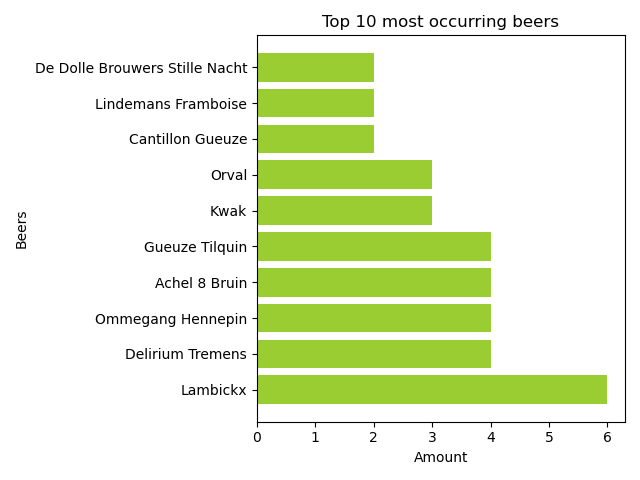

# OccurrenceCounter
This application counts the occurrences of items in a specific column of a CSV file and provides flexibility in presenting the results through various output options such as printing in the terminal, writing to an excel file and visualizing through a bar plot.

## usage
```bash
usage: python OccurenceCounter.py -i input.csv -d delimiter -c column [-H] [-l] [-e] [-s] [-g] [-n items] [-a] [-t title] [-x name] [-y name]

options: 
  -h, --help    show this help message and exit

  -i input.csv  Input CSV file path

  -d delimiter  Specify the delimiter used in the input file. Options: [tab, comma, colon, semicolon]

  -c column     Specify the column in the input file where the item is located

  -H            The input file contains a header

  -l            List items and their occurrence

  -e            Write list to excel file

  -s            Sort the items descendingly based on their occurrence

  -g            Generate an image

  -n items      Number of items to include in the bar plot (default: 10)

  -a            Include all items in the bar plot

  -t title      Title for the bar plot

  -x name       Label for the occurences (default: Occurence)

  -y name       Label for the items (default: Item)

```

## Restrictions
* The -e option can only be used in conjunction with the -l option. If the -e option is specified without the -l option, the program will exit with an error message OccurenceCounter.py: error: argument -e: invalid combination of arguments: the -e option can only be used with the -l option.
* The -n option and -a option cannot be used together. If both options are specified, the program will exit with an error message OccurenceCounter.py: error: argument -n and -a: invalid combination of arguments: the -n and -e option can not be used together.
* The -n option and -l option can only be used together when the -g option is also specified. If the -n option is specified with the -l option but not the -g option, the program will exit with an error message OccurenceCounter.py: error: argument -n and -l: illogical combination of arguments: the usage of the -n and -l option without the -g option does not make sense (list not connected to a barplot can not be limited with the -n option).

## Examples
```bash
python OccurrenceCounter.py -i input.csv -d tab -c 2 -l -e -x "Frequency" -y "Words"
```
This command will read the input.csv file, using a tab as the delimiter and column 2 as the column to count occurrences. It will list the items and their occurrences and write the list to an excel file with label "Frequency" for occurrences and "Words" for items.
```bash
python OccurrenceCounter.py -i input.csv -d comma -c 5 -H -g -t "Occurrences of Items in Column 5" -x "Frequency" -y "Items"
```
This command will read the input.csv file, using a comma as the delimiter and column 5 as the column to count occurrences. It assumes the input file has a header, generates a bar plot with the top 10 items (default value) based on their occurrences and a title of "Occurrences of Items in Column 5" with label "Frequency" for occurrences and "Items" for items.

```bash
python OccurrenceCounter.py -i input.csv -d comma -c 5 -H -l -g -n 8 -t "Occurrences of Items in Column 5"
```
This command will read the input.csv file, using a comma as the delimiter and column 5 as the column to count occurrences. It assumes the input file has a header, lists the items and their occurrences (linked to the bar plot that is being generated), generates a bar plot with the top 8 items based on their occurrences and a title of "Occurrences of Items in Column 5".

```bash
python OccurrenceCounter.py -i input.csv -d comma -c 5 -H -le -s -g -a -t "All Occurrences of Items in Column 5" -x "Frequency" -y "Items"
```
This command will read the input.csv file, using a comma as the delimiter and column 5 as the column to count occurrences. It assumes the input file has a header, lists the items and their occurrences, sorts the items based on their occurrences in descending order, writes the list to an excel file, and then generates a bar plot with all items, with a title of "All Occurrences of Items in Column 5" with label "Frequency" for occurrences and "Items" for items.

## BelgianBeers.csv
An example CSV file is available in the repository that contains information about some Belgian beers. The file includes the following columns: name, brewery, style, abv, and ibu. This file can be used as a sample input for testing the program.
Please note that the information provided in this example file might not be 100% correct and accurate, it serves for demonstration purposes only.



## Dependencies
This application requires python3 and the following packages: matplotlib and openpyxl
